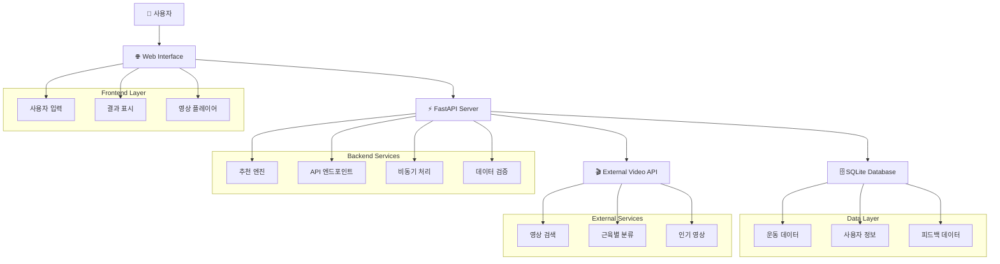
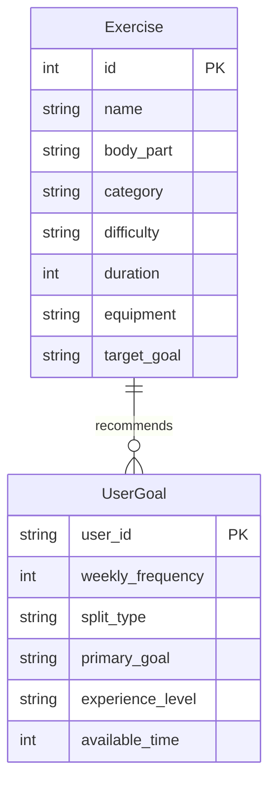
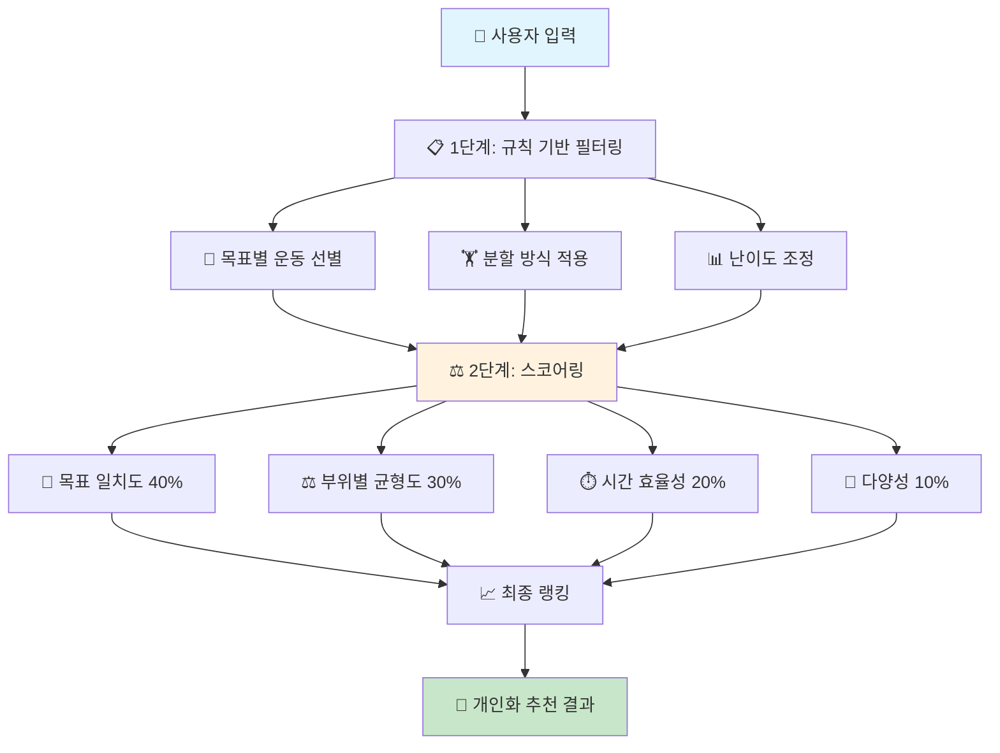
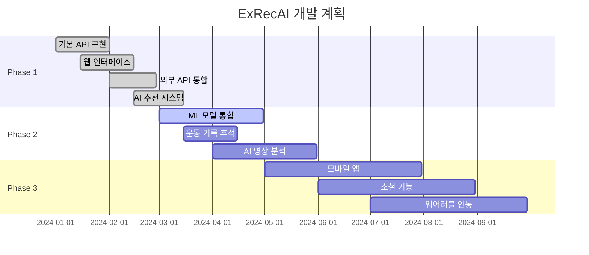

<div align="center">

# 🏋️ ExRecAI - 운동 추천 AI 시스템

[](https://python.org)
[](https://fastapi.tiangolo.com)
[](https://sqlite.org)
[](LICENSE)

> **AI로 더 스마트한 운동을!** 💪

사용자의 운동 목표와 선호하는 루틴을 바탕으로 개인화된 운동을 추천하는 지능형 시스템

[🚀 빠른 시작](#-빠른-시작) • [📚 문서](#-주요-기능) • [🔧 설치](#-설치-방법) • [📖 API 문서](http://localhost:8000/docs)

</div>

---

## 📋 프로젝트 개요

ExRecAI는 머신러닝과 규칙 기반 알고리즘을 활용하여 사용자 맞춤형 운동 프로그램을 제공하는 지능형 추천 시스템입니다. 개인의 목표, 경험 수준, 시간 제약을 고려하여 최적화된 운동 루틴을 제안합니다.

### 🎯 주요 기능

<table>
<tr>
<td width="50%">

#### 🎯 **개인 맞춤 추천**
- 사용자 목표별 맞춤 운동
- 경험 수준 고려한 난이도 조정
- 시간 제약에 따른 최적화

#### 📅 **스마트 루틴 플래너**
- 주간 빈도별 분할 (3-5회)
- 부위별 균형잡힌 분할
- 진행 상황 추적

</td>
<td width="50%">

#### 🎬 **영상 통합 시스템**
- 실제 운동 영상 제공
- 키워드/부위별 검색
- 자세 가이드 영상

#### ⚡ **실시간 성능**
- FastAPI 기반 고속 응답
- 비동기 처리
- 확장 가능한 아키텍처

</td>
</tr>
</table>

## 🏗️ 시스템 아키텍처

<div align="center">



</div>

## 🛠️ 기술 스택

<table>
<tr>
<td width="33%" align="center">

### 🖥️ **Backend**


- **FastAPI**: 고성능 웹 프레임워크
- **SQLAlchemy**: ORM (Object-Relational Mapping)
- **SQLite**: 경량 데이터베이스
- **Pydantic**: 데이터 검증 및 모델링

</td>
<td width="33%" align="center">

### 🤖 **AI/ML**


- **scikit-learn**: 머신러닝 알고리즘
- **pandas**: 데이터 처리
- **numpy**: 수치 계산
- **httpx**: 비동기 HTTP 클라이언트

</td>
<td width="33%" align="center">

### 🎨 **Frontend**


- **HTML/CSS/JavaScript**: 기본 웹 인터페이스
- **Bootstrap**: UI 프레임워크
- **반응형 디자인**: 모바일 최적화

</td>
</tr>
</table>

## 📊 데이터 모델

<div align="center">

### 🏃‍♂️ **운동 정보 (Exercise)**



</div>

<table>
<tr>
<td width="50%">

### 🏋️‍♂️ **운동 정보 (Exercise)**

| 필드 | 타입 | 설명 |
|------|------|------|
| `id` | `int` | 운동 고유 ID |
| `name` | `string` | 운동 명칭 |
| `body_part` | `string` | 주요 운동 부위 |
| `category` | `string` | 운동 유형 |
| `difficulty` | `string` | 난이도 |
| `duration` | `int` | 예상 소요 시간(분) |
| `equipment` | `string` | 필요 장비 |
| `target_goal` | `string` | 목표 유형 |

**카테고리:**
- 🏋️ 웨이트
- 🤸 체중
- 🏃 유산소
- 🤸‍♀️ 스트레칭

</td>
<td width="50%">

### 👤 **사용자 목표 (UserGoal)**

| 필드 | 타입 | 설명 |
|------|------|------|
| `user_id` | `string` | 사용자 ID |
| `weekly_frequency` | `int` | 주간 운동 빈도 |
| `split_type` | `string` | 분할 방식 |
| `primary_goal` | `string` | 주 목표 |
| `experience_level` | `string` | 경험 수준 |
| `available_time` | `int` | 1회 운동 가능 시간 |

**목표 유형:**
- 💪 근육 증가
- 🏃‍♀️ 다이어트
- ⚡ 체력 향상

</td>
</tr>
</table>

## 🧠 추천 알고리즘

<div align="center">



</div>

<table>
<tr>
<td width="33%">

### 📋 **1단계: 규칙 기반 필터링**

- **분할 방식 적용**
  - 2분할: 상체/하체
  - 3분할: 가슴/등/하체
  - 전신: 모든 부위

- **목표별 운동 선별**
  - 근육 증가: 웨이트 위주
  - 다이어트: 유산소 + 웨이트
  - 체력 향상: 전반적 균형

- **난이도 조정**
  - 초급: 기본 동작
  - 중급: 복합 운동
  - 고급: 고강도 운동

</td>
<td width="33%">

### ⚖️ **2단계: 스코어링 및 랭킹**

| 요소 | 가중치 | 설명 |
|------|--------|------|
| 🎯 **목표 일치도** | 40% | 사용자 목표와 운동의 적합성 |
| ⚖️ **부위별 균형도** | 30% | 근육군별 균형잡힌 분배 |
| ⏱️ **시간 효율성** | 20% | 제한 시간 내 최적 운동 |
| 🎲 **다양성** | 10% | 운동의 다양성과 흥미도 |

**점수 계산:**
```
최종 점수 = (목표일치도 × 0.4) + (부위균형도 × 0.3) + (시간효율성 × 0.2) + (다양성 × 0.1)
```

</td>
<td width="33%">

### 🚀 **3단계: 개인화 (추후 확장)**

- **사용자 피드백 학습**
  - 운동 만족도 분석
  - 선호 운동 패턴 학습
  - 개인 맞춤 조정

- **협업 필터링**
  - 유사 사용자 분석
  - 인기 운동 추천
  - 트렌드 반영

- **성과 기반 조정**
  - 진행률 추적
  - 목표 달성도 분석
  - 프로그램 자동 조정

</td>
</tr>
</table>

## 🚀 빠른 시작

<div align="center">

### ⚡ **5분 만에 시작하기**

[](https://gitpod.io/#https://github.com/your-repo/ExRecAI)
[](https://heroku.com/deploy?template=https://github.com/your-repo/ExRecAI)

</div>

<table>
<tr>
<td width="50%">

### 🔧 **설치 방법**

#### 1️⃣ **환경 설정**
```bash
# 저장소 클론
git clone https://github.com/your-repo/ExRecAI.git
cd ExRecAI

# Python 가상환경 생성
python -m venv venv

# 가상환경 활성화
# Windows
venv\Scripts\activate
# macOS/Linux
source venv/bin/activate

# 의존성 설치
pip install -r requirements.txt
```

#### 2️⃣ **데이터베이스 초기화**
```bash
python init_database.py
```

#### 3️⃣ **서버 실행**
```bash
python main.py
```

#### 4️⃣ **웹 인터페이스 접속**
🌐 **http://localhost:8000**

</td>
<td width="50%">

### 📱 **사용법**

#### 🎯 **운동 추천 받기**
1. 웹 인터페이스 접속
2. 목표 및 선호도 입력
3. AI 추천 결과 확인
4. 운동 영상 시청

#### 🔍 **영상 검색**
- 키워드로 운동 검색
- 부위별 운동 찾기
- 장비별 운동 필터링

#### 📊 **진행 상황 추적**
- 운동 기록 저장
- 목표 달성도 확인
- 피드백 제공

</td>
</tr>
</table>

### 🐳 **Docker로 실행하기**

```bash
# Docker 이미지 빌드
docker build -t exrecai .

# 컨테이너 실행
docker run -p 8000:8000 exrecai
```

## 📁 프로젝트 구조

<div align="center">

```
ExRecAI/
├── 📄 README.md                    # 프로젝트 개요 및 가이드
├── 📋 EXTERNAL_API_INTEGRATION.md  # 외부 API 통합 가이드
├── 🎮 DEMO_GUIDE.md               # 데모 및 사용 가이드
├── 📦 requirements.txt            # Python 의존성 목록
├── 🚀 main.py                     # FastAPI 메인 서버
├── 🗄️ init_database.py           # 데이터베이스 초기화
├── 🧪 test_api.py                # API 테스트 스크립트
├── 🔗 test_external_api.py       # 외부 API 테스트
├── 📊 models/                     # 데이터 모델
│   ├── __init__.py
│   ├── 🗃️ database.py            # SQLAlchemy 모델
│   └── 📋 schemas.py             # Pydantic 스키마
├── ⚙️ services/                   # 비즈니스 로직
│   ├── __init__.py
│   ├── 🧠 recommendation.py      # AI 추천 엔진
│   ├── 🗄️ database_service.py    # 데이터베이스 서비스
│   ├── 🔗 external_api.py        # 외부 API 연동
│   └── 🎬 external_recommendation.py # 외부 추천 서비스
├── 🎨 static/                     # 정적 파일
│   ├── 📱 index.html             # 웹 인터페이스
│   ├── 💄 css/
│   │   └── style.css             # 커스텀 스타일
│   └── ⚡ js/
│       ├── app.js                # 메인 JavaScript
│       └── video-handlers.js     # 영상 관련 핸들러
├── 📊 data/                       # 데이터 파일
│   ├── exercises.json            # 운동 데이터
│   └── fitness.db                # SQLite 데이터베이스
└── 🧪 tests/                      # 테스트 파일
    └── __init__.py
```

</div>

### 📂 **디렉토리 설명**

<table>
<tr>
<td width="50%">

#### 🏗️ **핵심 구조**
- **`main.py`**: FastAPI 서버 진입점
- **`models/`**: 데이터베이스 및 API 모델
- **`services/`**: 비즈니스 로직 및 추천 엔진
- **`static/`**: 웹 인터페이스 파일

#### 🧪 **테스트 & 개발**
- **`test_*.py`**: API 및 외부 서비스 테스트
- **`tests/`**: 단위 테스트 디렉토리
- **`requirements.txt`**: 프로젝트 의존성

</td>
<td width="50%">

#### 📊 **데이터 & 설정**
- **`data/`**: 운동 데이터 및 데이터베이스
- **`init_database.py`**: DB 초기화 스크립트
- **`*.md`**: 프로젝트 문서화

#### 🔗 **외부 연동**
- **`external_api.py`**: 외부 운동 영상 API
- **`external_recommendation.py`**: 외부 추천 서비스

</td>
</tr>
</table>

## 🎮 API 사용 예시

### 🚀 **기본 운동 추천 API**

<table>
<tr>
<td width="50%">

#### 📤 **요청 예시**
```http
POST /api/recommend
Content-Type: application/json

{
  "user_id": "demo_user",
  "weekly_frequency": 4,
  "split_type": "3분할",
  "primary_goal": "근육 증가",
  "experience_level": "중급",
  "available_time": 60
}
```

#### 🎬 **향상된 추천 API (영상 포함)**
```http
POST /api/recommend/enhanced?include_videos=true
Content-Type: application/json

{
  "user_id": "demo_user",
  "weekly_frequency": 4,
  "split_type": "3분할", 
  "primary_goal": "근육 증가",
  "experience_level": "중급",
  "available_time": 60
}
```

</td>
<td width="50%">

#### 🔍 **영상 검색 API**
```http
GET /api/videos/search?keyword=벤치프레스&target_group=성인&size=10
```

#### 📊 **API 응답 예시**
```json
{
  "success": true,
  "recommendation": {
    "Day 1 - 가슴/삼두": [
      {
        "name": "벤치프레스",
        "sets": 4,
        "reps": "8-12",
        "rest": "2-3분",
        "video_url": "https://..."
      }
    ]
  },
  "total_duration": 240,
  "tips": "중급자는 compound 운동을 우선적으로 수행하세요."
}
```

</td>
</tr>
</table>

### 🎯 **주요 API 엔드포인트**

| 엔드포인트 | 메소드 | 설명 |
|------------|--------|------|
| `/api/recommend` | `POST` | 기본 운동 추천 |
| `/api/recommend/enhanced` | `POST` | 영상 포함 추천 |
| `/api/videos/search` | `GET` | 운동 영상 검색 |
| `/api/exercises` | `GET` | 운동 목록 조회 |
| `/api/user/feedback` | `POST` | 사용자 피드백 |
| `/docs` | `GET` | Swagger UI 문서 |

### 🔧 **cURL 예시**

```bash
# 기본 추천 요청
curl -X POST "http://localhost:8000/api/recommend" \
     -H "Content-Type: application/json" \
     -d '{
       "user_id": "demo_user",
       "weekly_frequency": 4,
       "split_type": "3분할",
       "primary_goal": "근육 증가",
       "experience_level": "중급",
       "available_time": 60
     }'

# 영상 검색
curl "http://localhost:8000/api/videos/search?keyword=벤치프레스&size=5"
```

## 🔮 향후 계획

<div align="center">

### 🗓️ **개발 로드맵**



</div>

<table>
<tr>
<td width="33%">

### ✅ **Phase 1 (완료)**
- [x] 기본 웹 API 구현
- [x] 규칙 기반 추천 시스템
- [x] 웹 인터페이스
- [x] 외부 운동 영상 API 통합
- [x] 향상된 AI 추천 (영상 포함)
- [x] 사용자 피드백 시스템

**주요 성과:**
- 🚀 안정적인 API 서비스
- 🎬 영상 통합 시스템
- 🎯 개인화 추천 엔진

</td>
<td width="33%">

### 🚧 **Phase 2 (진행 중)**
- [ ] 머신러닝 모델 통합
- [ ] 운동 기록 추적 시스템
- [ ] AI 영상 분석 (자세 교정)
- [ ] 성능 최적화

**예상 완료:**
- 📊 ML 기반 추천 개선
- 📈 운동 진행률 분석
- 🎥 실시간 자세 피드백

</td>
<td width="33%">

### 🔮 **Phase 3 (계획)**
- [ ] 모바일 앱 (React Native)
- [ ] 소셜 기능 (운동 친구, 챌린지)
- [ ] 개인 트레이너 연결
- [ ] 웨어러블 디바이스 연동

**장기 목표:**
- 📱 크로스 플랫폼 지원
- 👥 커뮤니티 기능
- 🏃‍♂️ 실시간 생체 데이터

</td>
</tr>
</table>

## 🤝 기여하기

<div align="center">

### 💡 **기여 방법**

[](http://makeapullrequest.com)
[](https://github.com/your-repo/ExRecAI/issues)
[](https://github.com/your-repo/ExRecAI/stargazers)

</div>

### 🛠️ **개발 환경 설정**

```bash
# Fork 후 클론
git clone https://github.com/YOUR_USERNAME/ExRecAI.git
cd ExRecAI

# 개발 환경 설정
python -m venv venv
source venv/bin/activate  # Windows: venv\Scripts\activate
pip install -r requirements.txt
pip install -r requirements-dev.txt  # 개발용 의존성

# 테스트 실행
pytest tests/
```

### 📝 **기여 가이드라인**

1. **🐛 버그 리포트**: GitHub Issues를 통해 버그를 신고해주세요
2. **✨ 기능 제안**: 새로운 기능 아이디어를 Issues에 공유해주세요
3. **🔧 코드 기여**: Fork → Branch → PR 순서로 기여해주세요
4. **📚 문서 개선**: README나 코드 주석 개선도 환영합니다

## 📞 문의사항

<div align="center">

### 📧 **연락처**

[](mailto:contact@exrecai.com)
[](https://discord.gg/exrecai)
[](https://twitter.com/exrecai)

</div>

프로젝트 관련 질문이나 개선 제안이 있으시면 언제든 연락주세요!

---

<div align="center">

**🏋️‍♂️ ExRecAI** - AI로 더 스마트한 운동을! 💪

[](https://github.com/your-repo/ExRecAI)
[](https://opensource.org/licenses/MIT)

</div>

#### Phase 1 (완료) ✅
- [x] 기본 웹 API 구현
- [x] 규칙 기반 추천 시스템
- [x] 웹 인터페이스
- [x] 외부 운동 영상 API 통합
- [x] 향상된 AI 추천 (영상 포함)

#### Phase 2 (1-2개월)
- [x] 사용자 피드백 시스템 ✅
- [ ] 머신러닝 모델 통합
- [ ] 운동 기록 추적
- [ ] AI 영상 분석 (자세 교정)

#### Phase 3 (3-4개월)
- [ ] 모바일 앱 (React Native)
- [ ] 소셜 기능 (운동 친구, 챌린지)
- [ ] 개인 트레이너 연결
- [ ] 웨어러블 디바이스 연동

### 📞 문의사항

프로젝트 관련 질문이나 개선 제안이 있으시면 언제든 연락주세요!

---
**ExRecAI** - AI로 더 스마트한 운동을! 💪
# exerciesRecord-AI

