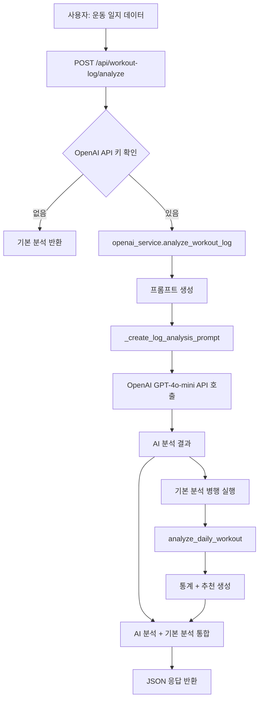
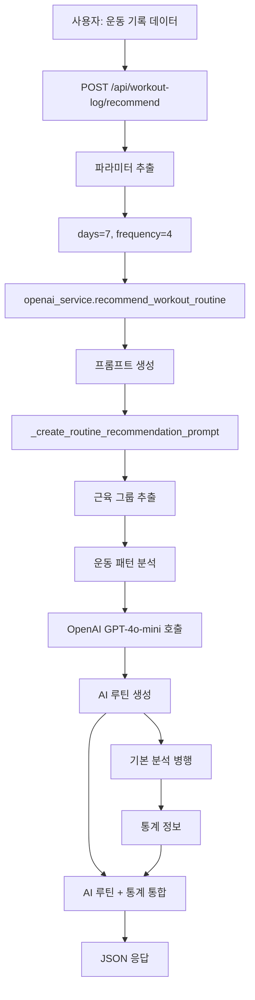
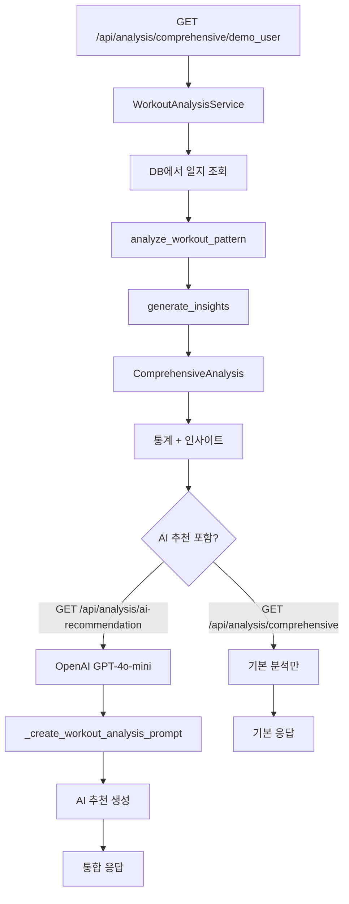

# 🏋️ ExRecAI 시스템 흐름도

## 📊 전체 시스템 아키텍처

```
┌─────────────────────────────────────────────────────────────┐
│                        사용자 (Flutter App)                    │
└────────────────────┬──────────────────────────────────────────┘
                     │
                     ▼
┌─────────────────────────────────────────────────────────────┐
│                    FastAPI Backend Server                     │
│                  (main.py - 포트 3000)                        │
└────────────────────┬──────────────────────────────────────────┘
                     │
         ┌───────────┴───────────┬───────────────┐
         │                       │               │
         ▼                       ▼               ▼
┌───────────────┐    ┌───────────────────┐   ┌───────────────┐
│  SQLite DB    │    │  OpenAI API       │   │ External API  │
│  (fitness.db) │    │  (GPT-4o-mini)    │   │ (KSPO 영상)   │
└───────────────┘    └───────────────────┘   └───────────────┘
```

---

## 🔄 주요 API 흐름

### 1️⃣ 운동 일지 AI 분석 흐름



#### **상세 단계:**

1. **사용자 요청**
   ```
   POST /api/workout-log/analyze?model=gpt-4o-mini
   Body: {
     "date": "2025-10-08",
     "memo": "근육을 추가한 후",
     "exercises": [...]
   }
   ```

2. **OpenAI 서비스 처리**
   - `openai_service.analyze_workout_log()` 호출
   - 시스템 프롬프트: "당신은 전문 운동 코치입니다..."
   - 사용자 프롬프트: 운동 일지 데이터 포맷팅

3. **GPT-4o-mini API 호출**
   ```python
   response = client.chat.completions.create(
       model="gpt-4o-mini",
       messages=[
           {"role": "system", "content": "..."},
           {"role": "user", "content": prompt}
       ],
       temperature=0.8,
       max_tokens=1500
   )
   ```

4. **응답 구조**
   ```json
   {
     "success": true,
     "ai_analysis": "당신의 운동을 분석한 결과...",
     "basic_analysis": {...},
     "model": "gpt-4o-mini",
     "date": "2025-10-08"
   }
   ```

---

### 2️⃣ 운동 루틴 추천 흐름



#### **상세 단계:**

1. **사용자 요청**
   ```
   POST /api/workout-log/recommend?days=7&frequency=4&model=gpt-4o-mini
   Body: {운동 일지 데이터}
   ```

2. **루틴 추천 로직**
   - 사용자의 운동 기록에서 근육 그룹 추출
   - 운동 패턴 분석
   - 주간 빈도와 일수 고려

3. **AI 프롬프트 예시**
   ```
   사용자의 최근 운동 기록:
   날짜: 2025-10-08
   
   주요 근육 그룹:
   어깨세모근, 큰가슴근, 위팔세갈래근
   
   주 4회, 7일간의 운동 루틴을 작성해주세요.
   
   - 전신 균형을 고려한 분할 방식
   - 적절한 운동 강도와 빈도
   - 점진적 과부하 원칙
   - 안전하고 실천 가능한 루틴
   
   상세한 운동명, 세트, 횟수, 휴식시간까지 포함해주세요.
   ```

4. **응답 구조**
   ```json
   {
     "success": true,
     "ai_routine": "다음 7일간의 운동 루틴:\n\nDay 1 (가슴/삼두)...",
     "basic_summary": {
       "date": "2025-10-08",
       "total_exercises": 2,
       "summary": "2025-10-08에 2개 운동을 총 0분간 수행..."
     },
     "routine_period": {
       "days": 7,
       "frequency": 4
     },
     "model": "gpt-4o-mini"
   }
   ```

---

### 3️⃣ 운동 패턴 종합 분석 흐름



---

## 📁 파일별 역할

### **services/openai_service.py**
```
OpenAIService 클래스
├── analyze_workout_log()
│   ├── _create_log_analysis_prompt()
│   └── GPT-4o-mini API 호출
│
├── recommend_workout_routine()
│   ├── _create_routine_recommendation_prompt()
│   └── GPT-4o-mini API 호출
│
└── generate_workout_recommendation()
    ├── _create_workout_analysis_prompt()
    └── GPT-4o-mini API 호출
```

### **main.py**
```
FastAPI 엔드포인트
├── POST /api/workout-log/analyze
│   └── analyze_workout_log_with_ai()
│
├── POST /api/workout-log/recommend
│   └── recommend_workout_routine()
│
├── GET /api/analysis/ai-recommendation/{user_id}
│   └── get_ai_recommendation()
│
└── 기존 분석 API들...
```

---

## 🔧 설정 및 실행 흐름

### **1. 환경 설정**
```bash
# .env 파일 생성
OPENAI_API_KEY=sk-your-key-here

# 또는 환경변수
export OPENAI_API_KEY="sk-your-key-here"
```

### **2. 서버 실행**
```bash
python main.py
# → 포트 3000에서 서버 시작
```

### **3. API 테스트**
```bash
python test_openai_analysis.py
# → 자동으로 API 테스트 실행
```

---

## 📊 데이터 흐름

```
운동 일지 데이터 (JSON)
       │
       ▼
   FastAPI Backend
       │
       ├─→ 기본 분석 (analyze_daily_workout)
       │   ├─→ 통계 계산
       │   ├─→ 부위별 분석
       │   └─→ 추천 생성
       │
       └─→ OpenAI GPT-4o-mini
           ├─→ 프롬프트 생성
           ├─→ API 호출
           └─→ AI 분석/추천
       │
       ▼
   통합 응답 (JSON)
```

---

## 🎯 사용 시나리오

### **시나리오 1: 운동 후 분석**
1. 사용자가 운동 일지 작성
2. `/api/workout-log/analyze` 호출
3. OpenAI가 운동 평가 및 피드백 생성
4. 사용자에게 분석 결과 전달

### **시나리오 2: 다음 주 운동 계획**
1. 사용자가 최근 운동 기록 제출
2. `/api/workout-log/recommend?days=7&frequency=4` 호출
3. OpenAI가 개인화된 7일 루틴 생성
4. 사용자에게 운동 계획 전달

### **시나리오 3: 장기 패턴 분석**
1. 사용자 ID로 최근 30일 데이터 조회
2. `/api/analysis/comprehensive/{user_id}?days=30` 호출
3. 기본 분석 + OpenAI 추천 통합
4. 종합 리포트 제공

---

## 💡 OpenAI 프롬프트 구조

### **시스템 프롬프트**
```
당신은 전문 운동 코치입니다. 
사용자의 운동 일지를 분석하여 맞춤형 조언을 제공합니다.
```

### **사용자 프롬프트 (운동 일지 분석)**
```
[운동 일지 정보]
날짜: 2025-10-08
메모: 근육을 추가한 후

[운동 상세]
운동 1:
- 운동명: 팔굽혀펴기
- 근육 부위: 어깨세모근, 큰가슴근, 위팔세갈래근
- 강도: 상
- 운동 시간: 20분
- 운동 도구: 매트

위 운동 일지를 분석하여 다음을 포함한 상세 평가를 작성해주세요:
1. 전반적인 운동 평가 (강도, 시간, 다양한성)
2. 타겟 근육 분석 및 효과
3. 좋은 점과 개선할 점
4. 다음 운동을 위한 구체적인 추천
5. 부상 예방을 위한 주의사항

친근하고 격려하는 톤으로 작성해주세요.
```

---

## 🔍 에러 처리

```
OpenAI API 호출 실패
    │
    ▼
기본 분석으로 Fallback
    │
    ▼
success: false + 기본 분석 결과 반환
```

---

이 흐름도가 전체 시스템을 이해하는데 도움이 되길 바랍니다! 🚀

